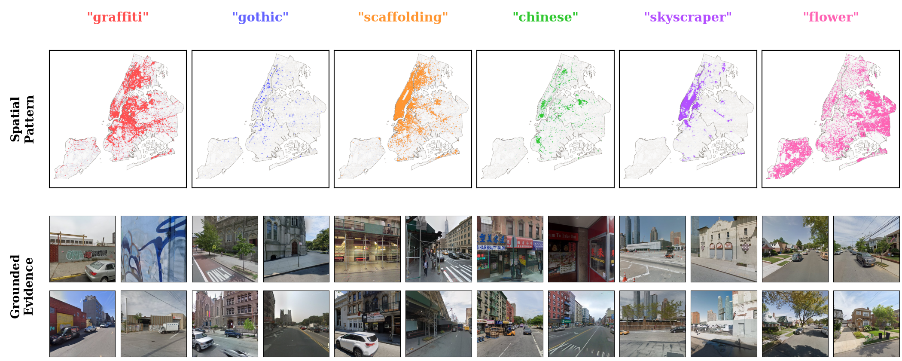
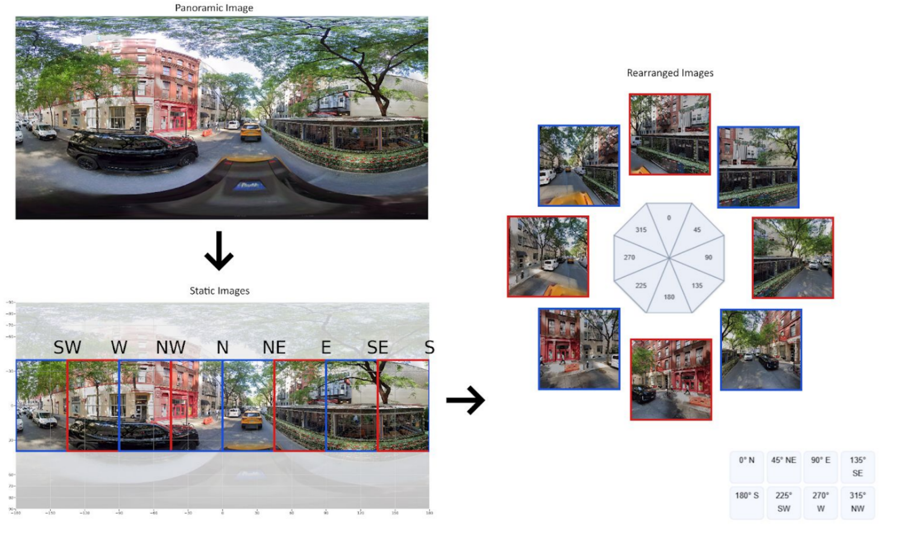

# Searchable.City

Search the visual life of cities. Searchable.City turns geolocated images into captions that can be searched, mapped, and reused.

[Website](https://searchable.city) · [Dataset](https://searchable.city/data) · [Paper](https://seanhardestylewis.com/papers/SearchableCity_SIGGRAPH_Paper.pdf)



*Visual queries reveal distinct patterns across New York City: graffiti, Gothic architecture, scaffolding, Chinese signage, skyscrapers, and flowers.*

## Setup

```sh
git clone https://github.com/seanhlewis/searchablecity.git
cd searchablecity
python -m venv .venv
source .venv/bin/activate  # Windows: .venv\Scripts\Activate.ps1
python -m pip install -e ./code
```

Requires Python 3.10+; Python 3.11 is tested for FastVLM. Search an existing caption dataset or generate captions for your own images.

## Search

Download a caption file from [searchable.city/data](https://searchable.city/data). Imagery is optional: searching captions requires no images, model weights, or GPU.

```sh
searchablecity index --input data/captions.parquet --output runs/city.sqlite
searchablecity search --database runs/city.sqlite --query 'murals OR graffiti' --output runs/results.geojson --geojson
```

CSV and JSONL also work. For a quick example without a download, substitute `examples/demo.csv` for the input. Search matches words and phrases using SQLite FTS5. The output retains captions, coordinates, and source metadata.

## Captioning

```text
Geolocated images → optional panorama crops → captions → searchable index → map
```

Start with local Mapillary images or images from another source. Describe each image in a JSONL manifest:

```json
{"image_id":"001","image_path":"001.jpg","lat":37.77,"lng":-122.42,"image_provider":"Mapillary","source_url":"https://www.mapillary.com/app/?pKey=001","attribution":"Source contributor"}
```

The row above illustrates the format; replace it with your image's actual ID and attribution. Paths are relative to the image folder. Keep any capture dates, headings, and other metadata in the row; the pipeline carries them forward.

**Panoramas only:** add `compass_angle`, the heading at the panorama's horizontal center, and create eight overlapping views:

```sh
searchablecity prepare --input data/panoramas.jsonl --image-root data/images --output-dir runs/views
```

Each view covers 90 degrees, with centers 45 degrees apart. Ordinary photos already represent individual views and skip this step.



*From panoramas to directional views.*

**Caption the images:** install a PyTorch build appropriate for your hardware, then:

```sh
python -m pip install torch==2.6.0 torchvision==0.21.0 --index-url https://download.pytorch.org/whl/cu124
python -m pip install -e './code[vlm]' -c configs/fastvlm-constraints.txt
searchablecity caption --input data/images.jsonl --image-root data/images --config configs/fastvlm.json --output runs/captions.jsonl
```

For the panorama outputs, use `--input runs/views/images.jsonl --image-root runs/views`. The FastVLM config pins the GPU-tested model revision; change it when selecting another checkpoint. Then run `index` and `search` on the resulting caption file as above.

Edit `configs/fastvlm.json` to change the model, prompt, resolution, batch size, or generation length. Defaults are **FastVLM-0.5B**, **“Describe this image.”**, and **224-pixel short edge**. Use `configs/huggingface.json` for compatible Transformers VLMs, or add your own adapter. See [model settings](docs/MODELS.md).

## Visualization

```sh
npm --prefix visualization ci
npm run dev
```

Open `/dataset` at the local address printed by Vite and select your result GeoJSON. It displays the camera locations, captions, and metadata locally. Files are not uploaded.

The original website is at `/`; it needs the hosted city indexes and Mapbox configuration described in [deployment](docs/DEPLOYMENT.md). The local dataset viewer does not need those services.

## Structure

| Path | Purpose |
|---|---|
| `code/src/searchablecity/prepare.py` | Turn panoramas into individual views |
| `code/src/searchablecity/caption.py` | Caption images and retain their metadata |
| `code/src/searchablecity/backends.py` | Model-specific inference |
| `code/src/searchablecity/search.py` | Index and search captions |
| `code/src/searchablecity/records.py` | Read datasets and local images |
| `visualization/` | Website and result viewer |
| `configs/` | Editable model settings |

See [input fields](docs/INPUTS.md), [model settings](docs/MODELS.md), and [deployment](docs/DEPLOYMENT.md) for details.

## Development

Run these checks from the repository root:

```sh
python -m unittest discover -s code/tests
npm --prefix visualization run lint
npm --prefix visualization run build
```

See [model settings](docs/MODELS.md) for tested GPU configurations and batch sizes.

## Contributing

Created by **Sean Hardesty Lewis** · **end@mit.edu**. Issues, forks, and pull requests are welcome. For dataset issues, include the release version, source ID, and view/direction.

New model backends follow the [adapter contract](docs/MODELS.md); include a contract test and the GPU configuration used for validation. Preserve source-image associations and metadata. Keep datasets, model weights, credentials, and machine-specific paths out of Git.

Code is [MIT licensed](LICENSE). Datasets, source imagery, and model weights retain their own licenses and attribution.
